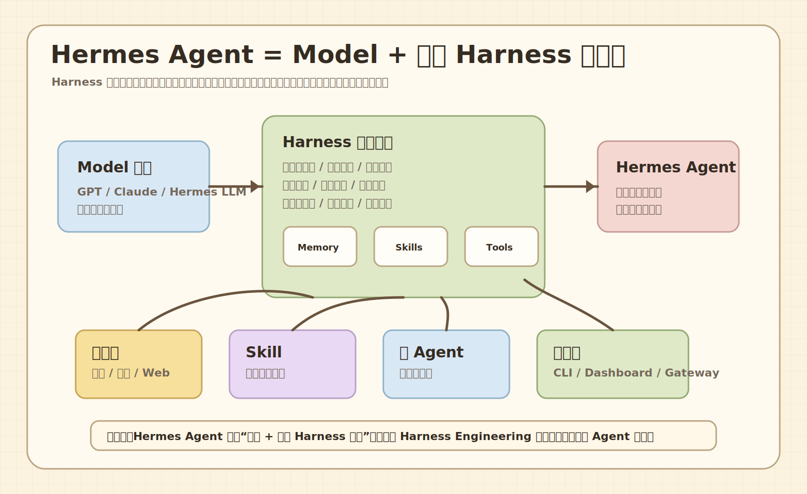

# Harness 和 Hermes Agent 到底是什么关系

先把最容易混的概念掰清楚。

一句话结论：

**Hermes Agent 不是 Hermes 模型再加上某个叫 Harness 的独立项目；Hermes Agent 是把 Harness Engineering 这套“驾驭大模型工作”的方法论，直接做成了一个完整开源 Agent 框架。**

这句话很重要。很多人第一次听到 Hermes、Harness、Agent、Codex、模型这些词，会下意识以为它们是一堆同级软件，像积木一样拼起来。实际上不是。

更准确的理解方式是：

- Model 是大脑。
- Harness 是控制系统和运行时思想。
- Hermes Agent 是一套已经实现了 Harness 能力的完整 Agent 框架。



## 1. 先分清 Harness 是什么

**Harness 不是一个具体软件，而是一套架构思想。**

行业里常见的公式是：

```text
Agent = Model + Harness
```

这句话翻成人话就是：

```text
真正能做事的 Agent = 会思考的模型 + 会约束、调度、执行、验证的外壳
```

这里的 `Model` 可以是：

- GPT-5.4
- Claude
- Gemini
- Hermes LLM
- 本地 Llama
- 任何兼容接口的大模型

这里的 `Harness` 负责的是模型外面的执行骨架。

它通常要处理：

- 记忆和用户画像
- 上下文管理
- 工具调用
- 沙箱执行
- 多步骤任务规划
- 任务状态保存
- 权限约束
- 失败重试
- 输出验证
- 反馈闭环

所以 Harness 更像“AI 的操作系统/运行时”，不是某个固定项目名。

## 2. 为什么光有 Model 不够

如果只有模型，你拥有的是一个会生成文本的大脑。

它可以回答：

- 这段代码什么意思
- 这个命令应该怎么写
- 这篇文档怎么总结

但它天然不等于一个可靠执行者。

一个可靠 Agent 还需要知道：

- 当前工作目录在哪里
- 哪些文件能读写
- 哪些命令可以执行
- 任务做到哪一步了
- 上一次失败原因是什么
- 是否需要继续调用工具
- 最终结果是否符合用户目标

这些都不是“模型本身”天然解决的问题，而是 Harness 要负责的问题。

## 3. Harness 这个词为什么叫“缰绳”

`Harness` 本意有“缰绳、挽具、驾驭系统”的意思。

用在 AI Agent 里，很形象：

- 模型有力量，但方向不稳定。
- 工具有能力，但权限有风险。
- 任务能拆解，但过程会跑偏。

Harness 的作用就是把这些力量拴到一个可控工作流里。

它不是削弱模型，而是让模型能稳定干活。

## 4. Hermes Agent 是什么

Hermes Agent 是 Nous Research 做的一个开源 Agent 框架。

它的定位可以理解成：

```text
把 Harness Engineering 做成现成产品，开箱即用。
```

也就是说，Hermes Agent 不是：

```text
Hermes 模型 + 某个独立 Harness 项目
```

而是：

```text
一个内置 Harness 能力的完整 Agent 框架
```

它内部已经实现了很多 Harness 该做的事情，比如：

- 持久记忆
- 会话存储
- 工具系统
- Skill 系统
- 多 Agent 委派
- CLI 入口
- Web Dashboard
- 消息平台 Gateway
- Cron 定时任务
- 终端后端和容器/远端执行能力

## 5. Hermes Agent 和 Hermes 模型不是一回事

这也是新手最容易搞混的地方。

Hermes LLM 是模型。

Hermes Agent 是 Agent 框架。

Hermes Agent 可以接：

- OpenAI
- Anthropic
- OpenRouter
- Nous Portal
- 本地模型
- 自定义 OpenAI-compatible endpoint

所以 Hermes Agent 不绑定 Hermes LLM。

你可以用 Hermes Agent 调用 GPT，也可以调 Claude，也可以调你自己的本地模型。

## 6. “Hermes + Harness”这种说法对不对

口语上可以这么理解，但严格说不准确。

可以说：

```text
Hermes Agent 是一个内置完整 Harness 能力的框架。
```

不建议说：

```text
Hermes Agent = Hermes 模型 + 某个独立 Harness 项目。
```

原因有两个：

1. Hermes Agent 可以接任意模型，不绑定 Hermes 模型。
2. 它的 Harness 能力是框架内置的，不是外面拼了一个叫 Harness 的项目。

## 7. 用最直白的类比理解

把它想成一辆车。

- Model = 发动机
- Harness = 整车控制系统和设计规范，比如底盘、刹车、方向盘、变速箱、安全系统
- Hermes Agent = 已经造好的完整汽车

如果你问：

```text
这辆车是不是发动机 + 规范拼起来的？
```

严格说：

```text
它是按这套规范造好的整车，不是发动机和规范两张皮。
```

## 8. Hermes Agent 内置的 Harness 层长什么样

可以按层看：

### 输入入口层

你可以从这些地方进入 Hermes Agent：

- CLI
- TUI
- Web Dashboard
- Telegram / Discord / Slack 等 Gateway
- Cron 自动任务
- ACP 编辑器集成

### 推理层

这里接的是模型 provider：

- OpenAI
- Anthropic
- Nous
- OpenRouter
- Custom endpoint

### Harness 核心层

这里负责真正的 Agent 行为：

- 拼装系统提示词
- 管理上下文
- 决定是否调用工具
- 保存会话
- 触发记忆
- 调度子任务
- 处理失败和重试

### 执行层

这里负责让 Agent 真正动手：

- 终端命令
- 文件读写
- Web 搜索
- Browser 工具
- MCP server
- 外部平台 API

### 持久化层

这里让 Agent 不会每次都像第一次见你：

- sessions
- memories
- skills
- config
- logs

## 9. 小白最该记住的判断标准

看到一个“AI 工具”时，你可以问 4 个问题：

1. 它只是模型，还是有 Harness？
2. 它能不能调用工具？
3. 它能不能保存长期状态？
4. 它能不能跨多步骤任务保持目标？

如果答案都偏“能”，它就更接近 Agent 框架。

如果只是给你一个模型 API，它就更像 Model 层。

## 10. 本教程后面怎么展开

接下来你会看到：

- Harness Agent 和 Codex 这类工具有什么区别
- Hermes Agent 具体能做什么
- 怎么安装
- 怎么配置 provider
- 怎么理解工具、记忆、Skill、MCP
- 怎么部署和排错

先把 Harness 和 Model 的关系搞清楚，后面所有概念都会顺很多。
