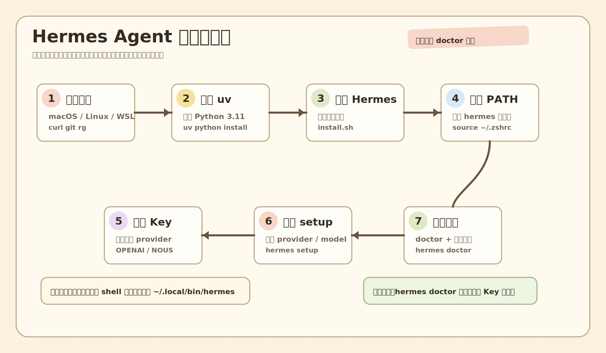

# 安装总路线

## 安装前先判断你属于哪种情况

最常见的是这 4 类：

1. 本机 macOS 安装
2. Linux 或 WSL 安装
3. VPS 安装
4. 后面还想接 Docker、消息平台和定时任务

这份仓库先以 “本机先跑通，再扩到 VPS 和 Docker” 为主路线。

## 官方安装方式是什么

官方推荐的一键安装是：

```bash
curl -fsSL https://hermes-agent.nousresearch.com/install.sh | bash
```

这条命令会处理很多依赖，不只是下载 Hermes 本体。

## 它大概会帮你装什么

官方说明里，安装器会尽量处理这些内容：

- `uv`
- Python 3.11
- Node.js
- ripgrep
- ffmpeg
- Hermes Agent 本体

## 为什么我们不建议你手抄零散命令

因为新手最容易在这些地方翻车：

- Python 版本不对
- `uv` 没装
- PATH 没刷新
- Shell 配置没生效
- provider 没配置
- 安装完以为就能直接用

所以这个仓库已经把安装动作包成了：

- [scripts/install-hermes-local.sh](scripts/install-hermes-local.sh)
- [scripts/verify-hermes-install.sh](scripts/verify-hermes-install.sh)

## 推荐你这样装

### 路线 A：完全跟官方走

```bash
curl -fsSL https://hermes-agent.nousresearch.com/install.sh | bash
```

适合：

- 你想最接近官方默认路径
- 你希望后续排错时更容易对照官方文档

### 路线 B：用本仓库脚本走

```bash
bash scripts/install-hermes-local.sh
```

适合：

- 你想把安装日志留在当前仓库
- 你希望一边搭建一边留痕
- 你后面还要回看自己做过什么

## 安装后必须做的 4 件事

1. 刷新 shell 环境
2. 确认 `hermes` 命令存在
3. 准备 provider key
4. 运行 `hermes setup` 或 `hermes model`

### 关于 PATH 的真实坑

这次实测安装时，Hermes 已经成功安装到 `~/.local/bin/hermes`，但当前 shell 的 `PATH` 里还没有 `~/.local/bin`，所以直接执行 `hermes` 会提示找不到命令。

处理方法通常是：

```bash
source ~/.zshrc
```

或者临时补上：

```bash
export PATH="$HOME/.local/bin:$PATH"
```

## 小白最容易忽略的一点

很多人会把“装成功”和“能正常对话”混为一谈。

实际上这是两件事：

- 安装成功：Hermes 程序在你电脑上存在
- 能正常对话：Hermes 已经知道用哪个 provider、哪个 model、用什么 key

没有第 2 步，程序就只是程序。

## 实操顺序

### 1. 先建 `.env`

```bash
bash scripts/bootstrap-env.sh
```

### 2. 复制并填写 provider key

看 [.env.example](.env.example)

### 3. 跑安装

```bash
bash scripts/install-hermes-local.sh
```

### 4. 跑验证

```bash
bash scripts/verify-hermes-install.sh
```

### 5. 进 Hermes 做首次配置

```bash
hermes setup
```

## 典型验证结果

你至少应该看到这些之一：

- `hermes --version` 有输出
- `hermes doctor` 能运行
- `~/.hermes` 目录已出现

## 如果这里就失败了

不要硬往后走，先看：

- [docs/10-troubleshooting/01-common-pitfalls.md](docs/10-troubleshooting/01-common-pitfalls.md)

## 安装流程图


