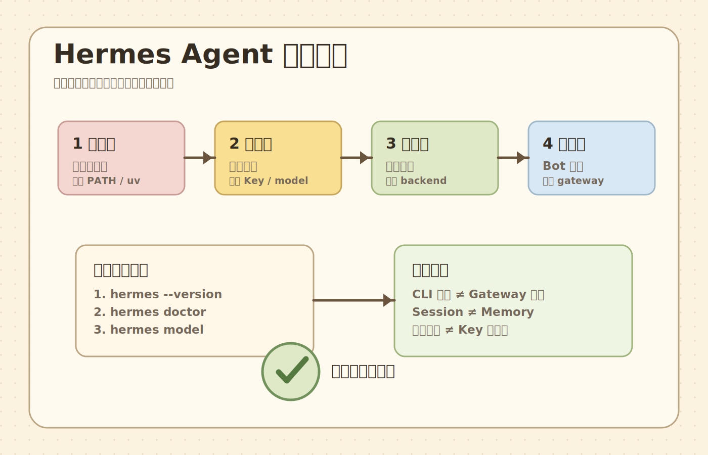

# 常见坑与排错手册

## 先记住排错总原则

不要一报错就全部重装。

Hermes 这种系统更适合按层排查：

1. 安装层
2. provider 层
3. CLI 层
4. tool 层
5. gateway 层
6. deploy 层

## 高频坑 1：`hermes` 命令找不到

### 表现

```bash
command not found: hermes
```

### 常见原因

- 安装没完成
- PATH 没刷新
- `~/.local/bin` 不在 PATH

### 处理

```bash
echo $PATH
ls ~/.local/bin
source ~/.zshrc
```

如果你已经确认 `~/.local/bin/hermes` 存在，但 `command -v hermes` 仍然找不到，那大概率就是 PATH 还没刷新。

## 高频坑 2：装好了但无法正常回答

### 常见原因

- provider key 没配
- model 没选对
- provider / model 不匹配

### 处理

```bash
hermes model
hermes doctor
```

## 高频坑 3：Python 版本不对

官方当前项目对 Python 有明确要求，不建议你随便拿系统自带高版本硬跑。

### 处理思路

- 优先走官方安装脚本
- 或让 `uv` 安装 Python 3.11

## 高频坑 4：`uv` 没装

### 处理

```bash
curl -LsSf https://astral.sh/uv/install.sh | sh
```

## 高频坑 5：CLI 正常，消息平台不正常

### 这说明什么

通常说明核心 agent 没完全坏，问题更可能在：

- token
- gateway
- 平台授权
- 会话路由

## 高频坑 6：执行命令时权限混乱

### 典型情况

- 某些命令能跑，某些不行
- sudo 行为异常
- 容器与宿主环境结果不一致

### 处理思路

先确认你当前到底在哪个 backend 执行。

## 高频坑 7：会话续不上

### 可能原因

- profile 不同
- 会话没保存
- 平台不同
- 你以为 memory 就等于 session history

## 高频坑 8：装完就急着接 MCP，结果问题越来越多

### 处理建议

先回到最小闭环：

1. CLI 正常
2. provider 正常
3. tool 最小化正常

再加 MCP。

## 高频坑 9：想省事，把权限给太大

短期可能很爽，长期很危险。

尤其是：

- 直接本机高权限执行
- 长期开启危险工具
- 消息平台开放给多人

## 高频坑 10：没有日志与验证习惯

很多人只凭感觉判断“好像能用”。这会导致后面根本不知道哪个版本、哪次配置、哪次重启把系统搞坏了。

## 推荐排错动作顺序

1. `hermes doctor`
2. `hermes model`
3. `hermes setup`
4. 看环境变量
5. 看执行 backend
6. 再考虑更深层扩展问题

## 情绪也很重要

新手最容易在这里焦虑，我专门放一张手帐风格排错图，提醒你按层拆问题。


