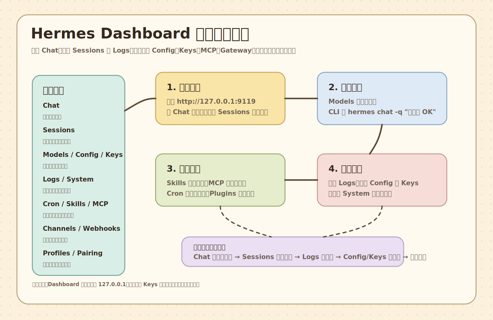

# Hermes Agent Dashboard 全面实战操作手册

这篇是整套教程的最后一篇实操文档，目标很直接：你已经把 Hermes Agent 启动起来了，浏览器右侧也能看到 `http://127.0.0.1:9119/sessions`，现在要知道“每个常见功能到底怎么点、怎么用、怎么验证、出错去哪看”。

先记住一句话：

> Dashboard 是 Hermes Agent 的可视化控制台；CLI 是最稳定的验证工具；Logs 是排错入口；Config 和 Keys 是高风险配置区。



## 1. 先确认你现在访问的是哪里

你现在看到的地址类似：

```text
http://127.0.0.1:9119/sessions
```

这里有三个关键词：

- `127.0.0.1`：只在当前机器本机访问，不是公网地址。
- `9119`：Dashboard 默认端口。
- `/sessions`：当前页面是会话历史页。

如果你在同一台电脑上访问，直接打开：

```text
http://127.0.0.1:9119
```

如果打不开，先在终端确认 Dashboard 是否还活着：

```bash
hermes dashboard --status
```

如果没有运行，启动它：

```bash
hermes dashboard --no-open
```

如果你想停掉它：

```bash
hermes dashboard --stop
```

如果端口被占用，可以换一个端口：

```bash
hermes dashboard --port 9120 --no-open
```

然后访问：

```text
http://127.0.0.1:9120
```

## 2. 新手先别乱点，按这个顺序熟悉

第一次用 Dashboard，建议按这个路线走：

1. 先看 `Sessions`：确认 Hermes 是否真的保存了会话。
2. 再进 `Chat`：发一句简单测试。
3. 再看 `Logs`：学会从日志判断问题。
4. 再看 `Models`：确认当前模型是什么。
5. 再看 `Config` 和 `Keys`：知道配置和密钥放在哪里，但不要随便改。
6. 最后再碰 `Cron`、`Skills`、`Plugins`、`MCP`、`Channels`、`Webhooks`。

为什么这么排？

因为 Agent 工具最容易让小白混乱的地方不是“按钮太少”，而是“入口太多”。你先学会聊天、历史、日志、模型这四件事，后面所有高级功能都能接上。

## 3. 左侧导航栏每一项是干什么的

你右侧截图里展开的导航栏，大致有这些菜单。

| 菜单 | 用途 | 新手优先级 |
| --- | --- | --- |
| `Chat` | 直接和 Hermes Agent 对话 | 最高 |
| `Sessions` | 查看、继续、管理历史会话 | 最高 |
| `Files` | 上传、查看、管理工作文件 | 中 |
| `Models` | 查看或切换模型设置 | 高 |
| `Logs` | 查看运行日志和错误日志 | 最高 |
| `Cron` | 创建和管理定时任务 | 中 |
| `Skills` | 查看、安装、管理技能 | 中 |
| `Plugins` | 安装和管理插件 | 中 |
| `MCP` | 接入 MCP 工具服务器 | 中高 |
| `Channels` | 管理外部消息渠道 | 中 |
| `Webhooks` | 管理 Webhook 入口 | 中 |
| `Pairing` | 授权外部用户或设备 | 中 |
| `Profiles` | 管理多套隔离配置 | 中 |
| `Config` | 查看和编辑配置 | 高风险 |
| `Keys` | 管理密钥和环境变量 | 高风险 |
| `System` | 系统状态、重启、更新 | 高 |
| `Documentation` | 查看内置文档 | 低 |

新手只要先掌握 `Chat`、`Sessions`、`Models`、`Logs`、`Config`、`Keys`、`System`，就已经能完成 80% 的日常操作。

## 4. Chat：最常用的对话入口

`Chat` 是你和 Hermes Agent 对话的地方。

适合做：

- 问一个问题。
- 让它总结文件。
- 让它写脚本。
- 让它帮你排错。
- 让它调用已经配置好的工具。

新手建议第一次只发非常短的句子：

```text
只回复：OK
```

如果它回复了 `OK`，说明至少三件事正常：

- Dashboard 能访问后端。
- 模型配置基本可用。
- API Key 或认证链路没有完全断掉。

同样的测试也可以用 CLI 做：

```bash
hermes chat -q "只回复：OK"
```

如果你希望输出更适合脚本读取，可以用安静模式：

```bash
hermes chat -q "只回复：OK" --quiet
```

也可以用 one-shot：

```bash
hermes -z "只回复：OK"
```

### Chat 里怎么写任务更稳

不要这样写：

```text
帮我搞一下项目
```

更稳的写法：

```text
请检查当前项目的 README 和 docs 目录，找出新手安装 Hermes Agent 时最容易缺失的步骤。只给我列出问题和建议，不要修改文件。
```

如果你希望它改文件，要明确授权：

```text
请在 docs 目录新增一篇安装排错文档，要求小白能看懂。完成后告诉我改了哪些文件，并运行一次 markdown 链接检查。
```

如果你不希望它动文件，要说清楚：

```text
只分析，不要修改任何文件。
```

### Chat 出现卡住怎么办

先不要乱刷新页面，按这个顺序排查：

1. 打开 `Logs` 看有没有错误。
2. 在终端跑 `hermes logs errors`。
3. 用 CLI 跑最小测试：`hermes chat -q "只回复：OK"`。
4. 如果 CLI 也失败，问题多半在模型、Key、网络或配置。
5. 如果 CLI 成功但 Dashboard 失败，问题多半在 Dashboard 后端或浏览器页面状态。

## 5. Sessions：历史会话管理

`Sessions` 是历史记录中心。你截图里显示了：

- `Total`：总会话数。
- `Active in store`：还在本地存储里的活跃会话。
- `Archived`：归档会话。
- `Messages`：消息总数。
- `cli: 7`：来源为 CLI 的会话数量。

### Sessions 里能做什么

常见用途：

- 找到刚才的对话。
- 看某次任务用了哪个模型。
- 判断一次请求有没有真正发送成功。
- 从历史会话继续上下文。
- 清理旧会话。
- 导出会话记录做备份或分析。

### CLI 查看会话

列出最近会话：

```bash
hermes sessions list
```

限制数量：

```bash
hermes sessions list --limit 20
```

只看 CLI 来源：

```bash
hermes sessions list --source cli
```

查看统计：

```bash
hermes sessions stats
```

重命名某个会话：

```bash
hermes sessions rename <session_id> "新标题"
```

导出会话：

```bash
hermes sessions export sessions-backup.jsonl
```

删除某个会话：

```bash
hermes sessions delete <session_id>
```

清理旧会话前请先导出。历史会话一旦删除，就不能指望模型还能记得那些上下文。

## 6. Files：文件入口

`Files` 用来处理 Dashboard 能看到或上传的文件。

适合：

- 上传一个文本文件让 Hermes 分析。
- 查看当前工作目录下的文件。
- 创建小文件。
- 让 Agent 围绕某些文件工作。

新手注意：

- 文件不是“发给模型就永久安全保存”的保险箱。
- 不要上传包含密码、身份证、私钥、商业合同的文件，除非你明确知道模型请求会发往哪里。
- 大文件可能会被截断、压缩或只读取部分内容。

更稳的做法是先用 CLI 让 Hermes 处理明确路径：

```bash
hermes chat -q "请读取当前目录 README.md，总结这份项目是做什么的"
```

如果你要让它改文件，最好加上边界：

```text
只允许修改 docs 目录，不要修改配置文件，不要提交 git。
```

## 7. Models：模型设置

`Models` 用来查看和切换模型。

你当前环境里已经配置过类似：

- 主模型：`gpt-5.4`
- provider：OpenAI 兼容接口
- 推理强度：`xhigh`
- 上下文窗口：大窗口配置

Dashboard 的 `Models` 页面通常适合做这几件事：

- 看当前默认模型。
- 修改新会话默认模型。
- 配置辅助任务模型。
- 发现模型没有加载或显示异常时，回到 CLI 检查。

### CLI 查看和选择模型

打开交互式模型选择：

```bash
hermes model
```

刷新模型列表缓存：

```bash
hermes model --refresh
```

临时指定模型运行一次：

```bash
hermes chat -q "只回复：OK" --model gpt-5.4
```

临时指定 provider：

```bash
hermes chat -q "只回复：OK" --provider OpenAI
```

如果你用的是自定义 OpenAI 兼容接口，provider 名字要以本机配置为准。不要只看教程里的名字，要用：

```bash
hermes config show
```

确认实际配置。

## 8. Logs：排错第一入口

`Logs` 是小白最应该学会看的页面。

页面里一般可以切：

- `AGENT`：Agent 主日志。
- `ERRORS`：错误日志。
- `GATEWAY`：消息网关日志。
- 日志等级：`DEBUG`、`INFO`、`WARNING`、`ERROR`。
- 组件：`gateway`、`agent`、`tools`、`cli`、`cron`。
- 行数：50、100、200、500。

### 最常用 CLI 日志命令

看最近 50 行主日志：

```bash
hermes logs
```

看错误日志：

```bash
hermes logs errors
```

实时追踪主日志：

```bash
hermes logs -f
```

看最近 1 小时：

```bash
hermes logs --since 1h
```

只看 WARNING 以上：

```bash
hermes logs --level WARNING
```

只看工具相关：

```bash
hermes logs --component tools
```

看 gateway 日志：

```bash
hermes logs gateway -n 100
```

### 小白看日志的顺序

1. 先看有没有 `ERROR`。
2. 再看错误发生时间是不是你刚才操作的时间。
3. 再看关键词：`auth`、`api key`、`model`、`timeout`、`rate limit`、`connection`、`permission`。
4. 如果看到 `401`，优先检查 Key。
5. 如果看到 `404`，优先检查 base URL、模型名、接口模式。
6. 如果看到 `timeout`，优先检查网络、代理、服务商接口状态。
7. 如果看到 `permission denied`，优先检查文件权限或工具权限。

## 9. Cron：定时任务

`Cron` 用来让 Hermes 定时执行任务。

适合：

- 每天早上总结某个目录里的日志。
- 每小时检查某个接口是否正常。
- 每周生成项目进度报告。
- 定期跑某个 Agent 任务。

不适合：

- 让它无边界地操作生产环境。
- 让它自动删除文件。
- 让它自动提交和推送代码但没有审查。

### CLI 管理定时任务

查看任务：

```bash
hermes cron list
```

创建任务：

```bash
hermes cron create
```

查看调度器状态：

```bash
hermes cron status
```

暂停任务：

```bash
hermes cron pause <job_id>
```

恢复任务：

```bash
hermes cron resume <job_id>
```

让某个任务下次 tick 执行：

```bash
hermes cron run <job_id>
```

删除任务：

```bash
hermes cron remove <job_id>
```

### 新手创建 Cron 的安全模板

推荐提示词：

```text
每天 09:00 检查当前项目 docs 目录是否有断链，只输出报告，不修改文件，不提交 git。
```

不推荐：

```text
每天自动修复所有问题并推到 GitHub。
```

后者风险太高，因为它同时包含自动修改、自动提交、自动推送，出错时很难第一时间发现。

## 10. Skills：技能系统

`Skills` 可以理解为“可复用的操作说明书”。

普通聊天是临时的，Skill 是沉淀下来的流程。比如：

- “怎么部署我的项目”。
- “怎么检查日志并判断服务是否健康”。
- “怎么按团队规范写 PR 描述”。
- “怎么处理某类固定格式的视频切片任务”。

### CLI 管理 Skills

列出已安装技能：

```bash
hermes skills list
```

搜索技能：

```bash
hermes skills search <关键词>
```

安装技能：

```bash
hermes skills install <技能名或地址>
```

检查更新：

```bash
hermes skills check
```

更新：

```bash
hermes skills update
```

配置启用状态：

```bash
hermes skills config
```

### Skill 和普通提示词的区别

普通提示词适合一次性任务：

```text
帮我总结这篇 README。
```

Skill 适合长期重复任务：

```text
以后遇到这个项目部署问题，都按固定步骤：检查容器、查日志、测端口、验证接口、输出结论。
```

如果你发现自己连续三次让 Hermes 做同一类事，就可以考虑沉淀成 Skill。

## 11. Plugins：插件

`Plugins` 是比 Skill 更大一层的扩展包。

Skill 更像“说明书”；Plugin 更像“功能包”，可能包含：

- 多个 Skill。
- Dashboard 页面扩展。
- MCP 配置。
- 工具脚本。
- 项目模板。

Dashboard 的 `Plugins` 页面一般能输入 GitHub 仓库地址或 `owner/repo` 简写来安装。

### CLI 管理插件

列出插件：

```bash
hermes plugins list
```

安装插件：

```bash
hermes plugins install owner/repo
```

更新插件：

```bash
hermes plugins update <plugin_name>
```

禁用插件：

```bash
hermes plugins disable <plugin_name>
```

启用插件：

```bash
hermes plugins enable <plugin_name>
```

删除插件：

```bash
hermes plugins remove <plugin_name>
```

### 插件安全提醒

插件可能带脚本、工具、配置和页面扩展。不要随便安装陌生来源插件。

安装前至少确认：

- 仓库来源可信。
- README 说清楚插件做什么。
- 最近有人维护。
- 没有要求你把密钥写进仓库。
- 不会默认开启高风险命令执行。

## 12. MCP：接入外部工具

MCP 是 Model Context Protocol，可以让 Hermes 接入外部工具服务器。

你可以把 MCP 理解成：

> 给 Agent 装工具插座。不同 MCP 服务器提供不同工具，比如数据库、浏览器、GitHub、项目管理、搜索、文件系统等。

### MCP 适合做什么

- 接 GitHub。
- 接数据库只读查询。
- 接浏览器自动化。
- 接内部系统。
- 接项目管理工具。
- 接文档知识库。

### CLI 管理 MCP

列出 MCP：

```bash
hermes mcp list
```

打开交互式选择器：

```bash
hermes mcp
```

查看官方目录：

```bash
hermes mcp catalog
```

安装目录里的 MCP：

```bash
hermes mcp install <name>
```

添加 MCP：

```bash
hermes mcp add
```

测试 MCP：

```bash
hermes mcp test <name>
```

配置工具启用状态：

```bash
hermes mcp configure
```

移除 MCP：

```bash
hermes mcp remove <name>
```

### MCP 新手安全边界

刚开始只接“只读”工具更稳。

推荐先接：

- 文档查询。
- 只读数据库。
- 只读 GitHub 查询。
- 本地无敏感目录的文件读取。

谨慎接：

- 能删除文件的文件系统工具。
- 能执行 shell 的工具。
- 能改数据库的工具。
- 能发消息、发邮件、发工单的工具。
- 能操作生产环境的工具。

## 13. Channels、Webhooks、Gateway：让外部消息进来

Dashboard 左侧有 `Channels` 和 `Webhooks`，底部还能看到 `Gateway Status`。

这几块可以理解为：

- `Gateway`：消息网关总开关。
- `Channels`：不同平台入口，比如 Telegram、Discord、Slack、WhatsApp 等。
- `Webhooks`：HTTP 回调入口，给外部系统调用。

### CLI 管理 Gateway

查看状态：

```bash
hermes gateway status
```

前台运行：

```bash
hermes gateway run
```

配置平台：

```bash
hermes gateway setup
```

安装为后台服务：

```bash
hermes gateway install
```

启动后台服务：

```bash
hermes gateway start
```

停止：

```bash
hermes gateway stop
```

重启：

```bash
hermes gateway restart
```

列出所有 profile 的 gateway 状态：

```bash
hermes gateway list
```

### Gateway 什么时候用

本地学习时可以先不用 Gateway。你只需要 Dashboard 和 CLI 就够了。

当你想让 Hermes 变成“可被消息平台叫醒的助手”时，再配置 Gateway。

比如：

- 在 Telegram 给 Hermes 发消息。
- 在 Slack 里让 Hermes 帮团队查资料。
- 通过 Webhook 让 CI 触发 Hermes 分析日志。

### Gateway 风险

Gateway 一旦接入外部平台，就不再只是你本机主动发消息了。你要考虑：

- 谁能给它发消息。
- 它能调用哪些工具。
- 它能不能读写本机文件。
- 它会不会泄露日志或密钥。
- 它出错时谁来兜底。

## 14. Pairing：授权用户或设备

`Pairing` 用来处理配对码和外部用户授权。

常见场景：

- 某个外部聊天账号想绑定到你的 Hermes。
- 某个设备请求访问 Hermes。
- 你需要批准或撤销某个用户。

### CLI 管理 Pairing

查看待批准和已批准用户：

```bash
hermes pairing list
```

批准配对码：

```bash
hermes pairing approve <code>
```

撤销用户：

```bash
hermes pairing revoke <user_id>
```

清空待处理配对：

```bash
hermes pairing clear-pending
```

### Pairing 安全提醒

不要批准你不认识的配对码。批准以后，对方可能能通过某个渠道向你的 Hermes 发消息。

如果你不确定是谁发起的，先不要批准。

## 15. Profiles：多套隔离身份

`Profiles` 用来创建多套 Hermes 配置。

你可以把 Profile 理解成“不同人格/不同工作区/不同配置空间”。

适合：

- 一个 profile 用来学习。
- 一个 profile 用来工作。
- 一个 profile 用来跑自动任务。
- 一个 profile 用来接消息平台。
- 一个 profile 用来测试新模型或新工具。

### CLI 管理 Profiles

列出：

```bash
hermes profile list
```

创建：

```bash
hermes profile create <name>
```

切换默认：

```bash
hermes profile use <name>
```

查看详情：

```bash
hermes profile show <name>
```

导出：

```bash
hermes profile export <name>
```

导入：

```bash
hermes profile import <archive>
```

删除：

```bash
hermes profile delete <name>
```

### Profile 新手建议

刚开始不要建太多。

推荐最多两个：

- `default`：日常学习和普通使用。
- `worker`：以后专门跑自动化任务。

等你真的需要隔离模型、密钥、工具权限时，再继续拆。

## 16. Config：配置中心

`Config` 是高风险区，因为它决定 Hermes 怎么运行。

常见配置包括：

- 默认模型。
- provider。
- base URL。
- 推理强度。
- 上下文窗口。
- 工具权限。
- Dashboard、Gateway、MCP、Skills 等设置。

### CLI 查看配置

查看配置：

```bash
hermes config show
```

查看配置文件路径：

```bash
hermes config path
```

打开编辑器：

```bash
hermes config edit
```

设置单个值：

```bash
hermes config set <key> <value>
```

检查配置：

```bash
hermes config check
```

迁移旧配置：

```bash
hermes config migrate
```

### 改配置前先做什么

改配置前建议先备份：

```bash
cp "$(hermes config path)" "$HOME/hermes-config-backup.yaml"
```

如果你要改 `.env`，也先知道它在哪里：

```bash
hermes config env-path
```

### Config 常见坑

`base_url` 写错：

- 症状：模型请求 `404`、`connection error`、`invalid endpoint`。
- 处理：确认服务商到底要不要 `/v1`。

模型名写错：

- 症状：`model not found`。
- 处理：用 `hermes model --refresh` 或服务商模型列表确认。

provider 名字写错：

- 症状：Hermes 找不到 provider 或没有带上正确认证。
- 处理：用 `hermes config show` 看 provider 实际名字。

上下文窗口写太大：

- 症状：请求慢、费用高、服务商拒绝。
- 处理：按服务商真实支持范围设置。

## 17. Keys：密钥管理

`Keys` 对应环境变量和 API Key。

最重要的原则：

> 密钥只放本机安全位置，不写进 Git 仓库，不写进公开文档，不截图发给别人。

### CLI 查看 .env 路径

```bash
hermes config env-path
```

常见 Key：

```text
OPENAI_API_KEY
ANTHROPIC_API_KEY
OPENROUTER_API_KEY
NOUS_API_KEY
```

如果你用 OpenAI 兼容服务，也通常还是用 `OPENAI_API_KEY`。

### Key 出错怎么看

常见错误：

- `401 Unauthorized`：Key 错、Key 过期、没有传到请求里。
- `403 Forbidden`：Key 没权限、账号不允许访问该模型。
- `429 Too Many Requests`：限流或余额不足。
- `insufficient quota`：余额或额度问题。

排查顺序：

1. 看 `Keys` 里有没有对应 Key。
2. 看 `Config` 里 provider 用的是哪个环境变量。
3. 跑 `hermes logs errors`。
4. 跑最小测试 `hermes chat -q "只回复：OK"`。

## 18. System：系统状态、重启、更新

`System` 是维护入口。

常见操作：

- 查看 Hermes 版本。
- 重启 Gateway。
- 更新 Hermes。
- 查看系统状态。

### CLI 系统检查

查看总体状态：

```bash
hermes status
```

环境诊断：

```bash
hermes doctor
```

版本：

```bash
hermes version
```

更新：

```bash
hermes update
```

备份 Hermes home：

```bash
hermes backup
```

导出调试摘要：

```bash
hermes dump
```

安全审计：

```bash
hermes security
```

### 什么时候该重启

可以重启的情况：

- 修改了 Gateway 配置。
- 安装或更新了插件。
- 修改了某些 provider 或工具配置后 Dashboard 还显示旧状态。
- 日志里提示服务需要重启。

不要把“重启”当万能药。如果模型调用失败，重启一般解决不了 Key 错、模型名错、base URL 错。

## 19. Documentation：内置文档

`Documentation` 是 Dashboard 自带文档入口。

适合：

- 查当前版本的官方说明。
- 看某个页面的解释。
- 对照 CLI 帮助命令。

但新手不要只看内置文档，因为内置文档往往默认你已经知道 Agent、provider、MCP、Gateway 这些概念。建议搭配本仓库前面的章节一起看。

## 20. Kanban 和 Achievements

截图里插件区域还能看到：

- `Kanban`
- `Achievements`

这类页面来自插件或内置扩展。

`Kanban` 通常用于任务板、多人协作、任务拆分。

`Achievements` 通常用于展示使用进度、成就或学习轨迹。

新手可以先不管它们。等你已经能稳定使用 Chat、Sessions、Logs、Config，再回头看插件扩展更顺。

## 21. 最常见的 12 个实战场景

### 场景 1：我只想确认 Hermes 能不能用

Dashboard：

1. 打开 `Chat`。
2. 输入 `只回复：OK`。
3. 看到 `OK` 就说明基础链路通。

CLI：

```bash
hermes chat -q "只回复：OK"
```

### 场景 2：我想看刚才的对话

Dashboard：

1. 打开 `Sessions`。
2. 找最近的 `Recent Sessions`。
3. 看标题、模型、消息数、来源标签。

CLI：

```bash
hermes sessions list --limit 10
```

### 场景 3：我想继续上一次对话

CLI：

```bash
hermes -c
```

或者指定名字：

```bash
hermes -c "my project"
```

或者指定 session id：

```bash
hermes --resume <session_id>
```

### 场景 4：我想知道模型为什么不回复

先跑：

```bash
hermes logs errors
```

再跑：

```bash
hermes chat -q "只回复：OK" --verbose
```

重点看：

- 是否 401。
- 是否模型不存在。
- 是否连接超时。
- 是否 base URL 错。

### 场景 5：我想看当前配置

Dashboard：

1. 打开 `Config`。
2. 看模型、provider、工具、Gateway 等配置。

CLI：

```bash
hermes config show
```

路径：

```bash
hermes config path
```

### 场景 6：我想改 API Key

Dashboard：

1. 打开 `Keys`。
2. 找对应变量。
3. 修改后保存。
4. 回到 `Chat` 测试。

CLI：

```bash
hermes config env-path
```

然后编辑对应 `.env` 文件。

测试：

```bash
hermes chat -q "只回复：OK"
```

### 场景 7：我想让 Hermes 读一个文件

把文件放到当前项目目录，然后问：

```text
请读取 README.md，给我用 10 句话说明这个项目是做什么的。
```

如果文件很大，换成：

```text
请先只读取 README.md 的目录结构和标题，不要全文总结。
```

### 场景 8：我想让 Hermes 修改项目

推荐提示词：

```text
请只修改 docs 目录，新增一篇新手排错文档。不要修改配置文件，不要提交 git。完成后告诉我文件路径和验证方式。
```

如果你允许提交：

```text
完成后请 git status，确认只包含本次文档修改，然后提交并推送。
```

### 场景 9：我想接一个外部工具

Dashboard：

1. 打开 `MCP`。
2. 查看可安装或已配置 MCP。
3. 优先选择只读工具。
4. 安装后测试。

CLI：

```bash
hermes mcp catalog
hermes mcp install <name>
hermes mcp test <name>
```

### 场景 10：我想每天自动跑一个任务

Dashboard：

1. 打开 `Cron`。
2. 新增任务。
3. 写清楚时间、任务、边界、输出。
4. 保存后查看任务列表。

CLI：

```bash
hermes cron create
hermes cron list
hermes cron status
```

推荐任务描述：

```text
每天 09:00 检查 docs 目录最近一天新增或修改的 Markdown 文件，只输出断链和错别字风险报告，不修改文件。
```

### 场景 11：我想让 Telegram/Slack 等平台也能叫 Hermes

先配置 Gateway：

```bash
hermes gateway setup
```

前台测试：

```bash
hermes gateway run
```

确认没问题后再安装后台服务：

```bash
hermes gateway install
hermes gateway start
```

不建议第一次就直接后台跑，因为前台运行更容易看到报错。

### 场景 12：我想更新 Hermes

Dashboard：

1. 打开左侧底部 `Update Hermes`。
2. 等更新完成。
3. 回到 `System` 或 `Logs` 查看结果。

CLI：

```bash
hermes update
hermes version
hermes doctor
```

更新前最好备份：

```bash
hermes backup
```

## 22. 新手最容易犯的 10 个错误

### 错误 1：把 Dashboard 当公网服务暴露

默认 `127.0.0.1` 是安全边界之一。

不要随便用：

```bash
hermes dashboard --host 0.0.0.0 --insecure
```

这会让局域网甚至公网更容易访问你的 Dashboard。Dashboard 里可能有配置、密钥和系统操作入口。

### 错误 2：把 API Key 写进 Git 仓库

不要把 Key 写进：

- `README.md`
- `docs/*.md`
- `.env.example` 的真实值
- 截图
- issue
- commit message

如果已经提交过 Key，应该立刻去服务商后台撤销并换新 Key。

### 错误 3：不知道问题该看哪里

记住顺序：

```text
Chat 失败 -> Logs -> CLI 最小测试 -> Config -> Keys -> System
```

不要一上来就重装。

### 错误 4：模型名和 provider 对不上

有些服务商虽然是 OpenAI 兼容接口，但模型名、base URL、认证方式可能不完全一样。

确认方式：

```bash
hermes config show
hermes model --refresh
```

### 错误 5：以为 MCP 装越多越好

工具越多，Agent 越容易选错工具，安全边界也越复杂。

新手先少装，只装正在用的。

### 错误 6：让 Cron 自动做危险操作

定时任务最适合“检查和报告”，不适合一上来就“自动删除、自动发消息、自动推生产”。

### 错误 7：忽略 Sessions

Sessions 能帮你判断任务有没有真的跑过、用了哪个模型、来源是 CLI 还是别的平台。

### 错误 8：不知道 Dashboard 和 CLI 是同一套 Hermes

Dashboard 是图形界面，CLI 是命令行入口。很多问题可以互相验证。

Dashboard 不正常时，用 CLI 测。

CLI 不正常时，看 Logs 和 Config。

### 错误 9：把 Profile 搞太多

Profile 太多会让你忘记自己改的是哪套配置。

先用默认 profile，真正需要隔离时再拆。

### 错误 10：没有备份

更新、改配置、改密钥、装插件前，至少知道怎么备份：

```bash
hermes backup
```

## 23. 一张“出问题时照着走”的排错清单

### A. 页面打不开

检查：

```bash
hermes dashboard --status
```

没运行就启动：

```bash
hermes dashboard --no-open
```

端口冲突就换端口：

```bash
hermes dashboard --port 9120 --no-open
```

### B. 页面打开了，但 Chat 不回复

检查错误：

```bash
hermes logs errors
```

跑 CLI：

```bash
hermes chat -q "只回复：OK"
```

如果 CLI 成功，优先重启 Dashboard：

```bash
hermes dashboard --stop
hermes dashboard --no-open
```

### C. CLI 也不回复

看配置：

```bash
hermes config show
```

看 Key 路径：

```bash
hermes config env-path
```

看诊断：

```bash
hermes doctor
```

### D. 模型返回 401

重点查：

- Key 是否正确。
- Key 是否过期。
- provider 是否使用了正确环境变量。
- 自定义接口是否需要特殊 header。

### E. 模型返回 404

重点查：

- `base_url` 是否多了或少了 `/v1`。
- 模型名是否真实存在。
- 当前接口到底是 `responses` 还是 `chat_completions`。

### F. 返回很慢

重点查：

- 模型是否太大。
- 上下文窗口是否太大。
- 网络是否慢。
- 工具调用是否卡住。
- 日志里是否反复 retry。

### G. 工具执行失败

重点查：

- 工具是否启用。
- 权限是否允许。
- 当前工作目录是否正确。
- 文件路径是否存在。
- MCP 是否连接成功。

## 24. 推荐的新手日常工作流

每天使用 Hermes 时，可以按这个节奏：

1. 打开 Dashboard：`http://127.0.0.1:9119`
2. 进 `Sessions` 看最近历史。
3. 进 `Chat` 发任务。
4. 任务失败就进 `Logs`。
5. 修改配置前先备份。
6. 涉及密钥只在 `Keys` 或本机 `.env` 处理。
7. 需要稳定复用的流程再沉淀成 `Skills`。
8. 需要外部工具才接 `MCP`。
9. 需要消息平台才开 `Gateway`。
10. 需要定期执行才用 `Cron`。

## 25. 一套可以直接复制的练习

### 练习 1：确认 Dashboard 和 CLI 都通

Dashboard Chat：

```text
只回复：Dashboard OK
```

CLI：

```bash
hermes chat -q "只回复：CLI OK"
```

### 练习 2：查看历史

```bash
hermes sessions list --limit 5
hermes sessions stats
```

然后回 Dashboard 的 `Sessions` 对照看。

### 练习 3：看日志

```bash
hermes logs -n 30
hermes logs errors -n 30
```

然后回 Dashboard 的 `Logs` 切换 `AGENT` 和 `ERRORS`。

### 练习 4：看配置但不修改

```bash
hermes config path
hermes config env-path
hermes config show
```

只看，不改。

### 练习 5：做一个安全的小任务

在 Chat 输入：

```text
请总结当前 Hermes Agent Dashboard 左侧每个菜单的用途。只输出列表，不修改任何文件。
```

### 练习 6：模拟排错

在 Chat 输入：

```text
如果 Hermes 返回 401、404、429、timeout，分别应该优先检查什么？请用表格回答。
```

这个练习不会改文件，但能帮你把排错思路练熟。

## 26. 最后给小白的一句话路线图

先别急着接一堆平台和工具。

你真正要先练会的是这条线：

```text
Chat 发任务 -> Sessions 找记录 -> Logs 查错误 -> Config 看配置 -> Keys 查密钥 -> CLI 做验证
```

这条线跑顺以后，Hermes Agent 就不再是一个“看起来很复杂的 AI 工具”，而会变成一个你能驾驭的 Agent 工作台。

